# Gerenciamento de Aquisições (Project Procurement Management)

## Table of Contents / Sumário
- [English Version](#english-version)
  - [About the Project](#about-the-project)
  - [Key Topics Covered](#key-topics-covered)
  - [How to Open the Presentation](#how-to-open-the-presentation)
  - [Presentation Slides Gallery](#presentation-slides-gallery)
- [Versão em Português](#versão-em-português)
  - [Sobre o Projeto](#sobre-o-projeto)
  - [Principais Tópicos Abordados](#principais-tópicos-abordados)
  - [Como Abrir a Apresentação](#como-abrir-a-apresentação)
  - [Galeria de Slides da Apresentação](#galeria-de-slides-da-apresentação)

---

# English Version

## Project Procurement Management - PMBOK Guide

### About the Project
This repository presents a detailed educational presentation on **Project Procurement Management** based on the PMBOK (Project Management Body of Knowledge) Guide. The presentation addresses the critical processes involved in purchasing or acquiring products, services, or results needed from outside the project team.

Whether an organization acts as the buyer or the seller, effective procurement management ensures proper contract handling, risk mitigation, alignment of expectations, and value maximization for all project stakeholders.

---

### Key Topics Covered

1. **Procurement Concepts & Purpose**:
   - Definition of project procurement and vendor-seller dynamics.
   - Purpose of contract management, change control, and legal agreement compliance.

2. **PMBOK Procurement Processes**:
   - **Plan Procurement Management**: Documenting purchasing decisions, specifying approaches, and identifying potential vendors.
   - **Conduct Procurements**: Obtaining supplier responses, evaluating bids, selecting vendors, and awarding contracts.
   - **Control Procurements**: Managing relationships, monitoring contract performance, and handling scope/contract changes.
   - **Close Procurements**: Finalizing each contract, auditing results, and archiving records for future reference.

3. **Real-World Case Studies & Applications**:
   - **Aerospace Industry**: Structural outsourcing, component manufacturing distribution across Europe (Airbus partnership: France, Germany, UK, Spain), and safety considerations (e.g., Alaska Airlines Flight 261).
   - **Automotive Industry**: Global supply chains, brand ownership structure across major car brands, and historical competition (Ford GT40 vs. Ferrari 412P).
   - **Franchising & Supply Chain**: McDonald's industrial agriculture and supply chain optimization.

---

### How to Open the Presentation

You can view the presentation in any of the following ways:

1. **GitHub PDF Viewer**: Click on the [`gereciamento_de_aquisicoes.pdf`](./gereciamento_de_aquisicoes.pdf) file directly in this repository to view it natively on GitHub.
2. **Local PDF Reader / Browser**: Download `gereciamento_de_aquisicoes.pdf` and open it with any browser (Chrome, Firefox, Edge, Safari) or PDF application (Adobe Acrobat, Evince, Preview).
3. **README Gallery**: Review all rendered high-resolution slides directly in the section below.

---

### Presentation Slides Gallery

Below are the rendered screenshots of all 22 slides included in the project presentation:

| Slide 01 - Cover | Slide 02 - Agenda |
| :---: | :---: |
|  | 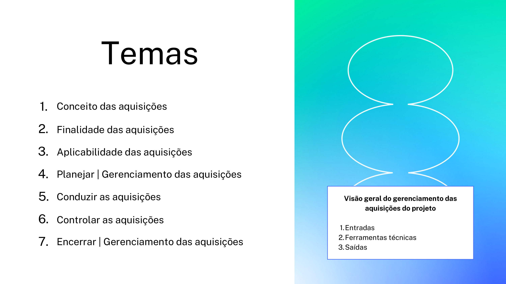 |

| Slide 03 - Concept of Procurements | Slide 04 - Alaska Airlines 261 Case |
| :---: | :---: |
| 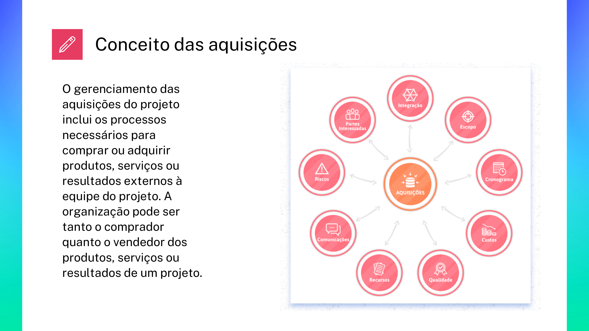 |  |

| Slide 05 - Horizontal Stabilizer Structure | Slide 06 - Purpose of Procurements |
| :---: | :---: |
| 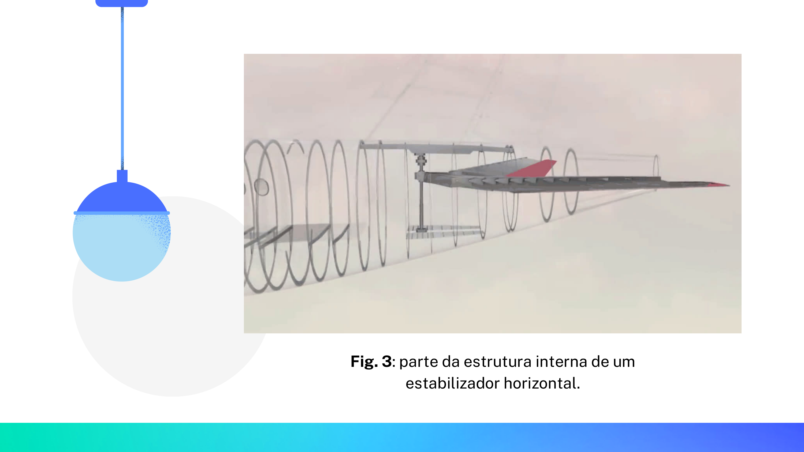 | 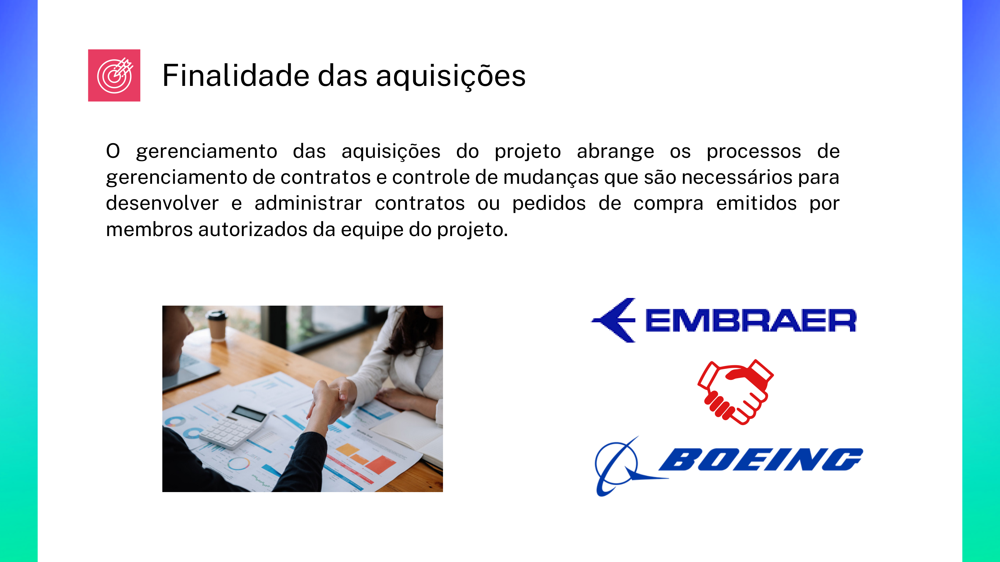 |

| Slide 07 - Applicability of Procurements | Slide 08 - Automotive Market Ownership |
| :---: | :---: |
|  | 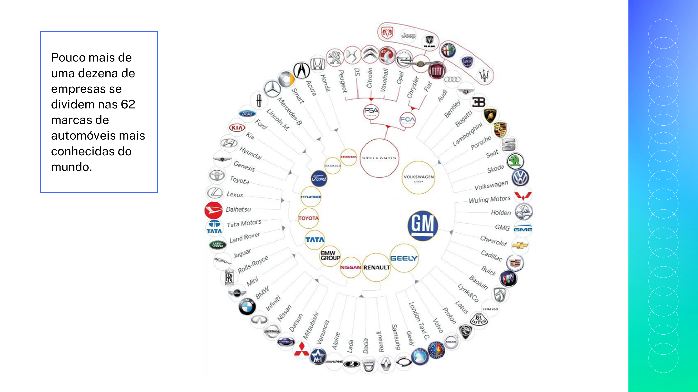 |

| Slide 09 - Plan Procurement Management | Slide 10 - Plan Procurements: ITTO |
| :---: | :---: |
|  | 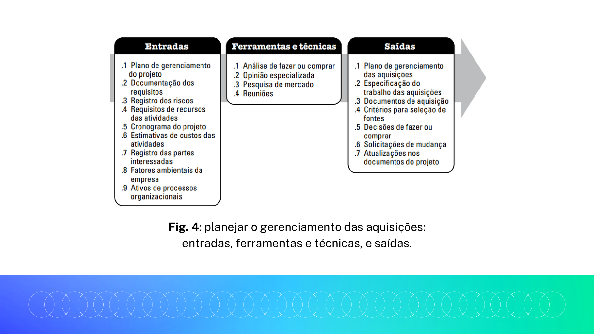 |

| Slide 11 - McDonald's Case Study | Slide 12 - Conduct Procurements |
| :---: | :---: |
| 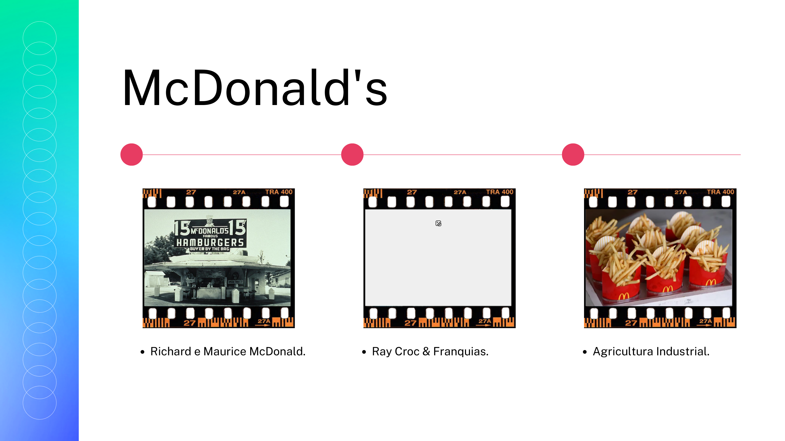 |  |

| Slide 13 - Conduct Procurements: ITTO | Slide 14 - Ford GT40 vs Ferrari 412P |
| :---: | :---: |
| 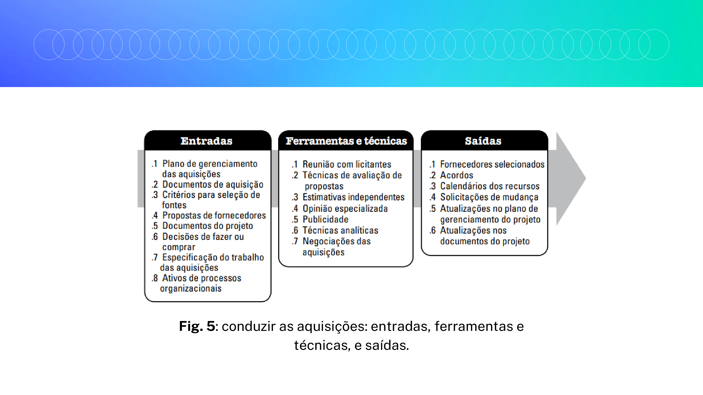 |  |

| Slide 15 - Control Procurements | Slide 16 - Control Procurements: ITTO |
| :---: | :---: |
| 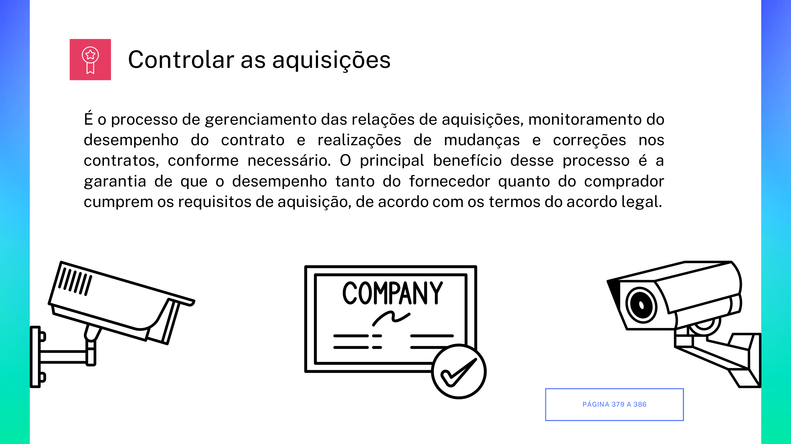 | 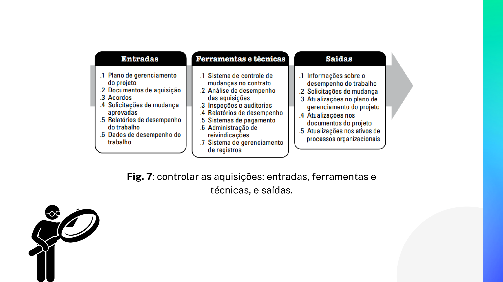 |

| Slide 17 - Intermediate Transition | Slide 18 - Close Procurements |
| :---: | :---: |
| 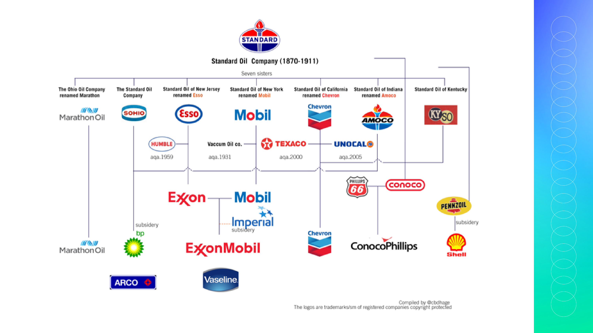 |  |

| Slide 19 - Close Procurements: ITTO | Slide 20 - Airbus Global Supply Network |
| :---: | :---: |
| 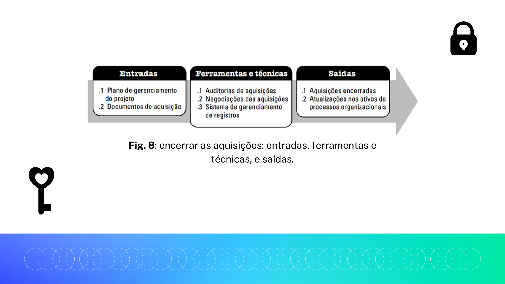 | 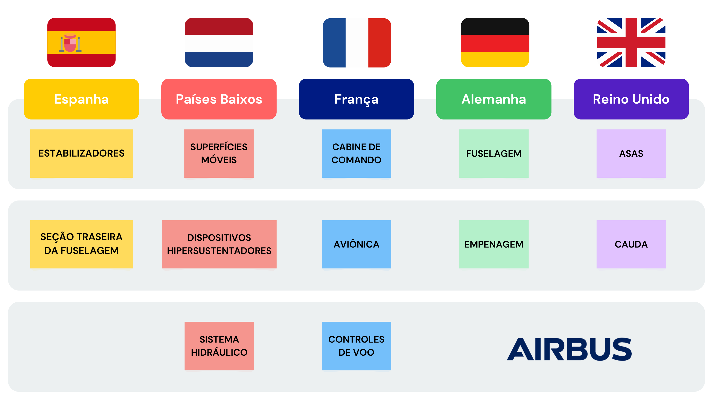 |

| Slide 21 - Conclusion | Slide 22 - Closing |
| :---: | :---: |
|  |  |

---
---

# Versão em Português

## Gerenciamento de Aquisições do Projeto - Guia PMBOK

### Sobre o Projeto
Este repositório contém uma apresentação educacional completa sobre **Gerenciamento de Aquisições do Projeto** com base nas diretrizes do Guia PMBOK (Project Management Body of Knowledge). A apresentação aborda os processos fundamentais necessários para comprar ou adquirir produtos, serviços ou resultados externos à equipe do projeto.

Quer a organização atue como compradora ou fornecedora, a gestão eficaz das aquisições garante a administração adequada de contratos, mitigação de riscos, alinhamento de expectativas e maximização de valor para o projeto.

---

### Principais Tópicos Abordados

1. **Conceito e Finalidade das Aquisições**:
   - Definição do gerenciamento de aquisições e relações fornecedor-comprador.
   - Administração de contratos, controle de mudanças e conformidade legal.

2. **Processos de Aquisição do PMBOK**:
   - **Planejar o Gerenciamento das Aquisições**: Documentação das decisões de compra, definição do planejamento e identificação de fornecedores em potencial.
   - **Conduzir as Aquisições**: Obtenção de respostas dos fornecedores, seleção do fornecedor e adjudicação do contrato.
   - **Controlar as Aquisições**: Gerenciamento das relações de aquisição, monitoramento do desempenho contratual e realização de ajustes necessários.
   - **Encerrar as Aquisições**: Finalização de cada contrato do projeto, documentação de acordos e arquivamento de registros para consultas futuras.

3. **Estudos de Caso Práticos e Aplicabilidade**:
   - **Setor Aeroespacial**: Terceirização de estruturas, distribuição da cadeia de fabricação na Europa (consórcio Airbus) e aspectos de segurança operacionais (ex: Voo Alaska Airlines 261).
   - **Setor Automotivo**: Cadeias globais de suprimentos, divisão de marcas globais entre grandes grupos automotivos e rivalidades históricas (Ford GT40 x Ferrari 412P).
   - **Franquias e Cadeia de Suprimentos**: Modelo de franquias e agricultura industrial do McDonald's.

---

### Como Abrir a Apresentação

Você pode visualizar a apresentação das seguintes formas:

1. **Visualizador de PDF do GitHub**: Clique no arquivo [`gereciamento_de_aquisicoes.pdf`](./gereciamento_de_aquisicoes.pdf) diretamente no repositório para visualizá-lo online.
2. **Leitor de PDF Local / Navegador Web**: Baixe o arquivo `gereciamento_de_aquisicoes.pdf` e abra-o com qualquer navegador (Google Chrome, Mozilla Firefox, Microsoft Edge) ou leitor de PDF dedicado (Adobe Acrobat, Evince, Preview).
3. **Galeria no README**: Confira abaixo as capturas de tela em alta resolução de todas as páginas da apresentação.

---

### Galeria de Slides da Apresentação

Abaixo estão renderizadas as capturas de tela das 11 páginas (22 slides) da apresentação do projeto:

| Slide 01 - Capa | Slide 02 - Temas |
| :---: | :---: |
|  |  |

| Slide 03 - Conceito das Aquisições | Slide 04 - Caso Alaska Airlines 261 |
| :---: | :---: |
|  |  |

| Slide 05 - Estrutura Estabilizador Horizontal | Slide 06 - Finalidade das Aquisições |
| :---: | :---: |
|  |  |

| Slide 07 - Aplicabilidade das Aquisições | Slide 08 - Mercado Automotivo Global |
| :---: | :---: |
|  |  |

| Slide 09 - Planejar Gerenciamento das Aquisições | Slide 10 - Planejar Aquisições: Entradas/Saídas |
| :---: | :---: |
|  |  |

| Slide 11 - Estudo de Caso McDonald's | Slide 12 - Conduzir as Aquisições |
| :---: | :---: |
|  |  |

| Slide 13 - Conduzir Aquisições: Entradas/Saídas | Slide 14 - Ford GT40 x Ferrari 412P |
| :---: | :---: |
|  |  |

| Slide 15 - Controlar as Aquisições | Slide 16 - Controlar Aquisições: Entradas/Saídas |
| :---: | :---: |
|  |  |

| Slide 17 - Transição Intermediária | Slide 18 - Encerrar as Aquisições |
| :---: | :---: |
|  |  |

| Slide 19 - Encerrar Aquisições: Entradas/Saídas | Slide 20 - Cadeia de Fornecimento Airbus |
| :---: | :---: |
|  |  |

| Slide 21 - Conclusão | Slide 22 - Encerramento |
| :---: | :---: |
|  |  |
